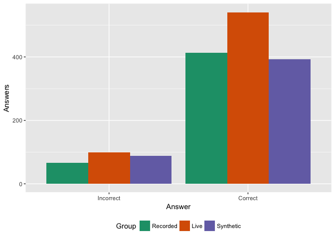
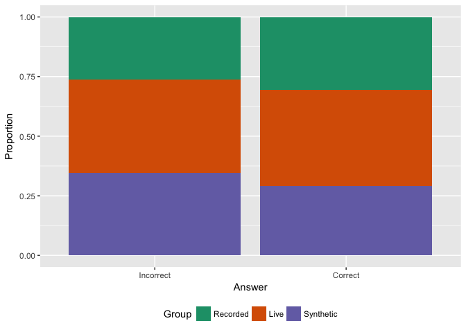
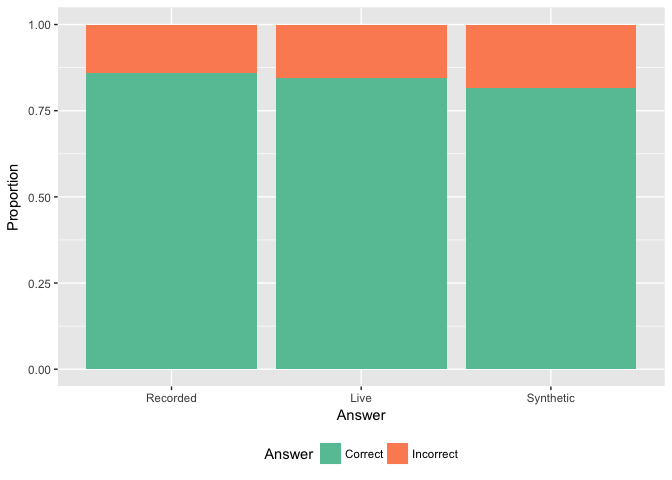
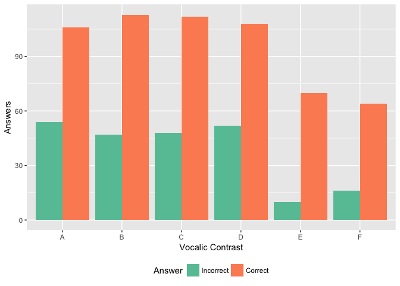
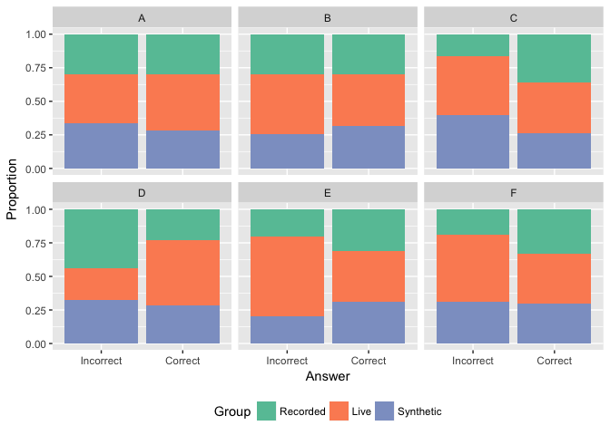
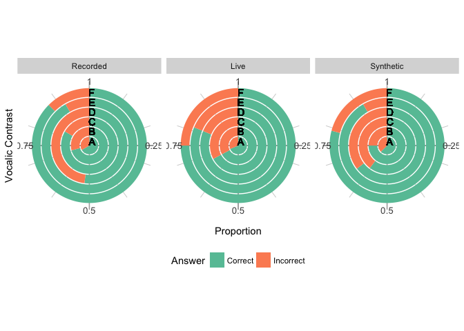

``` r
knitr::opts_chunk$set(echo = FALSE)
library(xtable)
library(wesanderson)
library(vcd)
library(ggplot2)
library(ca)
library(gmodels)
library(dplyr)
```

Descriptive statistics
----------------------

### Results per group

The database looks like this.

``` r
head(SpeechPerception)
```

    ## # A tibble: 6 x 6
    ##   Informante    Group    Answer  Intel Predic VocContrast
    ##        <int>   <fctr>    <fctr> <fctr> <fctr>      <fctr>
    ## 1          1 Recorded   Correct    Low    Low           A
    ## 2          1 Recorded Incorrect    Low    Low           A
    ## 3          1 Recorded   Correct    Low    Low           B
    ## 4          1 Recorded   Correct    Low    Low           B
    ## 5          1 Recorded Incorrect    Low    Low           C
    ## 6          1 Recorded   Correct    Low    Low           C

Looking at the results per group (ie, kind of voice heard), we find the following results

    ##            
    ##             Incorrect Correct
    ##   Recorded         67     413
    ##   Live             99     541
    ##   Synthetic        88     392

shown in the following graph



and as a table of proportions

    ##            
    ##             Incorrect  Correct
    ##   Recorded   0.041875 0.258125
    ##   Live       0.061875 0.338125
    ##   Synthetic  0.055000 0.245000

Describing the proportions per row, we have the following graph



and per column



### Analysis per vocalic contrast

The first thing is that there is a problem with the data. Actually, not a problem, but a fact of life almost: the vocalic contrast is only interesting when the intelligibility is low. For instance, compare the sentences

-   I gave her a kiss and a hug / hog
-   Lubricate the car with grease /gross

Both sentences are higly predictable, but one is also (very obviously) highly intelligible: there is no real comparison between grease and gross.

The table that shows us the number of answers per vocalic contrast is

``` r
respuestas <- table(SpeechPerception$VocContrast,SpeechPerception$Answer)
respuestas
```

    ##    
    ##     Incorrect Correct
    ##   A        54     106
    ##   B        47     113
    ##   C        48     112
    ##   D        52     108
    ##   E        10      70
    ##   F        16      64
    ##   Z        27     773

However, we can do much better than that. First of all, we are not interested in the Z comparison (that is my code for the null comparison)

``` r
InterestingVocContrasts <- subset(SpeechPerception, VocContrast != "Z")
head(InterestingVocContrasts)
```

    ## # A tibble: 6 x 6
    ##   Informante    Group    Answer  Intel Predic VocContrast
    ##        <int>   <fctr>    <fctr> <fctr> <fctr>      <fctr>
    ## 1          1 Recorded   Correct    Low    Low           A
    ## 2          1 Recorded Incorrect    Low    Low           A
    ## 3          1 Recorded   Correct    Low    Low           B
    ## 4          1 Recorded   Correct    Low    Low           B
    ## 5          1 Recorded Incorrect    Low    Low           C
    ## 6          1 Recorded   Correct    Low    Low           C

We can now look at a table and a graph showing us the not-so nitty-gritty details. As a matter of fact, none at all

    ##    
    ##     Incorrect Correct
    ##   A        54     106
    ##   B        47     113
    ##   C        48     112
    ##   D        52     108
    ##   E        10      70
    ##   F        16      64
    ##   Z         0       0



An interesting question would be to know if the different voice has any incidence in the results. We can look at it from many points of view. One could be to compare per vocalic contrast (using proportions allows us to see the differences per correct or incorrect answer without skewing)



Or we could compare per group (again, using proportions)



It is interesting to note how much more homogeneous is the live voice group. Also, the recorded voice and the synthetic voice groups look much more alike.
